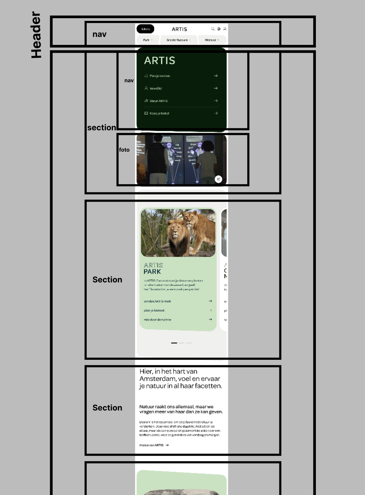
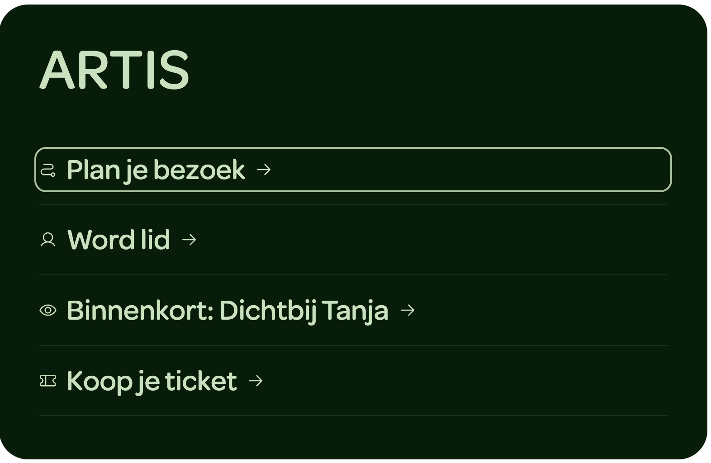
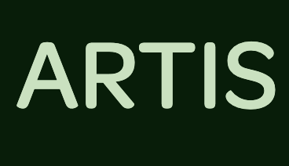
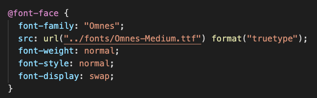
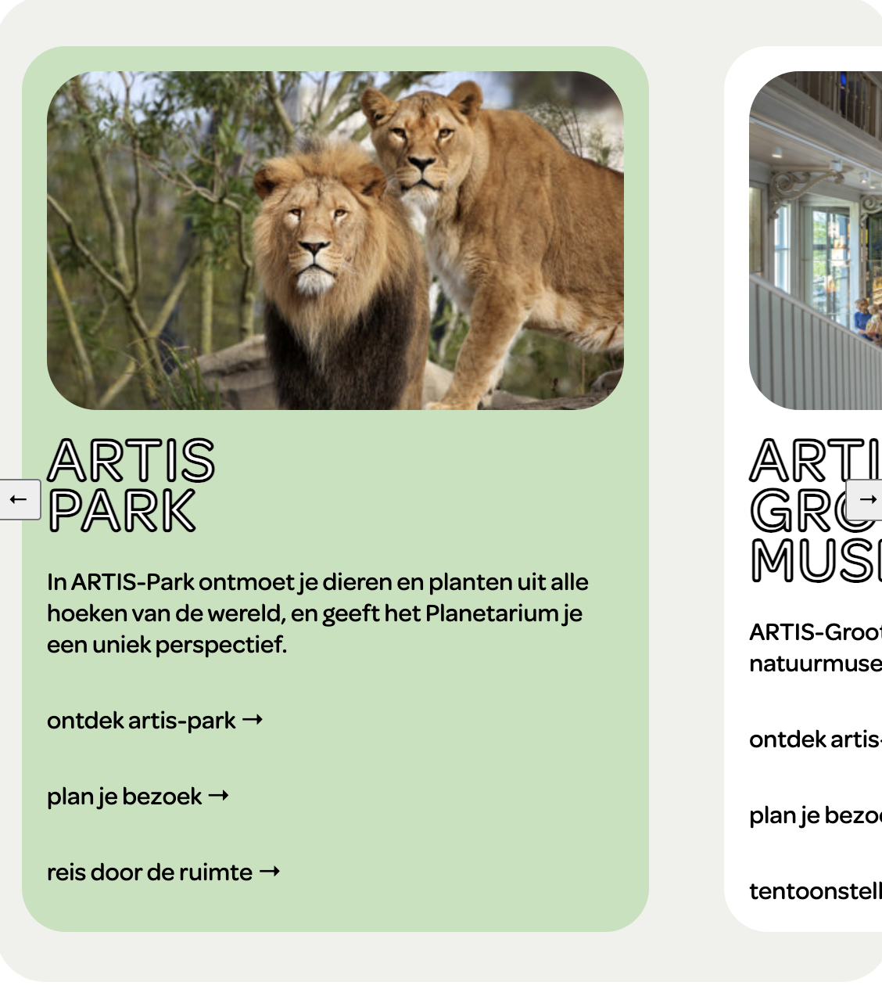
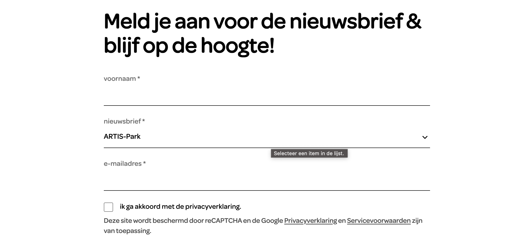

# Procesverslag
Markdown is een simpele manier om HTML te schrijven.  
Markdown cheat cheet: [Hulp bij het schrijven van Markdown](https://github.com/adam-p/markdown-here/wiki/Markdown-Cheatsheet).

Nb. De standaardstructuur en de spartaanse opmaak van de README.md zijn helemaal prima. Het gaat om de inhoud van je procesverslag. Besteedt de tijd voor pracht en praal aan je website.

Nb. Door *open* toe te voegen aan een *details* element kun je deze standaard open zetten. Fijn om dat steeds voor de relevante stuk(ken) te doen.

## Jij

  
uitwerken voor kick-off werkgroep

  ### Auteur:
  Nina van den Ham

  #### Je startniveau:
  Blauw

  #### Je focus:
  Responsive
 

## Je website

  
uitwerken voor kick-off werkgroep

  ### Je opdracht:
  https://www.artis.nl/nl

  #### Screenshot(s) van de eerste pagina (small screen): 
  Home
  

  #### Screenshot(s) van de tweede pagina (small screen):
  Plan je bezoek  
  
 

## Toegankelijkheidstest 1/2 (week 1)

  
uitwerken na test in 2e werkgroep

  ### Bevindingen
  Lijst met je bevindingen die in de test naar voren kwamen:
  1. De koppen in de website van Artis zijn op goede volgorde, er worden geen koppen overgeslagen.
  2. De links in de screen reader zijn logisch, met goede toelichting wat het duidelijk maakt wat het doel is van de link, waar het je brengt. Ook wordt er aangegeven als het een link is die al eerder bezocht is wordt dat ook benoemd door/in de voice over. 
  3. Er wordt gebruik gemaakt van pixels.
  4. Navigeren met het keyboard werkt niet en het komt dus niet overeen met de layout.
  5. Voor buttons wordt een class gebruikt (onder andere)
  6. De website van Artis heeft geen darkmode optie.
  

## Breakdownschets (week 1)

  
uitwerken na afloop 3e werkgroep

  ### de hele pagina: 
  

## Voortgang 1 (week 2)

  
uitwerken voor 1e voortgang

  ### Stand van zaken
  Ik ben al goed op weg met de html, maar ik heb twijfels over de structuur van de navigatie en de secties, waar een sectie begint en eindigt enzo.

  ### Agenda voor meeting
  samen met je groepje opstellen

  | Nina     | Lynn          | Beyza    | Zara        |
  | ---            | ---                | ---          | ---              |
  | De HTML structuur van de navigatie. | Welke elementen voor teksten.            | WCAG checklist   |     |
  |Start en eind van sections, plaats imgs.  |  |  | |
  |             |                 |           |               |

  ### Verslag van meeting
  hier na afloop snel de uitkomsten van de meeting vastleggen

  - Decoratieve foto's in css (background-image met url) backgorund-size: cover, background-position: center center
  - Caroussel configurater (Adam Argyle)
  - 2 navs in header
  - @media (prefers-reduced-motion:no-preferences) display:none,inline
  - image tussen sections
  - hidden text; lees meer 
  - inspecteren > vierkantjepijltje
  - svg inspecteren svg copy element

## Voortgang 2 (week 3)

  
uitwerken voor 2e voortgang

  ### Stand van zaken
  De html staat, maar nu begint de css, ik merk dat ik hier direct weer moeite mee heb, moet weer ven inkomen volgens mij.

  ### Agenda voor meeting
  samen met je groepje opstellen

  | Nina      | Lynn          | Beyza    | Zara        |
  | ---            | ---                | ---          | ---              |
  | css structuur sections  | Animatie van menu             | en ik dit    | Positioneren met css    |
  | |  |  |  |
  |             |                |           |               |

  ### Verslag van meeting
  hier na afloop snel de uitkomsten van de meeting vastleggen

  - Figure tag voor foto's
  - H1 in eerste sectie
  - Alvast tweede pagina maken
  - alt toevoegen aan foto's
  - elke section heeft een heading

  Button, links en co vormgeving
  a (links)
- Underline offset
- outline: none 
- cursor: pointer

  Button
- appearance none
- font: inherit
- active; translate: 

svg kleur
fill: 'color'

image invert
filter:invert

filter:brightness 0

image verandering
content: url
 

## Toegankelijkheidstest 2/2 (week 4)

  
uitwerken na test in 9e werkgroep

  ### Bevindingen
  Lijst met je bevindingen die in de test naar voren kwamen (geef ook aan wat er verbeterd is):
  Content: De gebruikte teksten, knoppen, linken etc. zijn uniek en duidelijk.

  Keyboard: Er is een duidelijk zichtbare focus style tijdens het navigeren met het toetsenbord, ik heb een style toegevoegd die overeenkomt met de stijl van de website. Soms komt de volgorde niet helemaal overeen met de visuele lay-out door de afwisseling op de verschillende schermgroottes. 
  

  Mobile and touch: De mobiele ervaring van de website is prima, geen bijzondere opmerkingen.

  Headings: De headings in de website kloppen, één h1 per pagina, logische volgorde en geen overgeslagen headings.

  Lists: Voor lijsten heb ik gebruik gemaakt van de juiste elementen.

  Images: Alle foto's hebben een alt attribute (een beschrijving van de foto's) en de decoratieve foto's hebben een null alt.

  Appearance: De originele website heeft geen dark mode functie, en deze heb ik wel toegevoegd, maar doordat ik helaas niet echt goed gebruik heb gemaakt van de custom properties, was dit lastig, heb de basis die werkt (kleur van tekst en achtergrond), maar zeker niet voldoende voor echte toegankelijkheid.

  Animation: Bij de animaties die Artis gebruikt voor de navigatie links viel het me op dat ze een beetje trippend zijn, niet echt toegankelijk, dus heb ik gekozen om deze animaties wat rustiger te maken, een subtiele beweging naar boven, duidelijk, maar ook niet overdreven.   

## Voortgang 3 (week 4)

  
uitwerken voor 3e voortgang

  ### Stand van zaken
  De website komt goed bij elkaar, heb wel nog moeite met bepaalde secties en responsivenes. De carousel werkt niet bijvoorbeeld, en veel secties moet nog een @media aan toegevoegd worden, moet nog even uitvinden hoe ik dit het mooiste het handigste kan doen.

  ### Agenda voor meeting
  samen met je groepje opstellen

  | student 1      | student 2          | student 3    | student 4        |
  | ---            | ---                | ---          | ---              |
  | Carousel werkt niet.  | en dit             | en ik dit    | en dan ik dat    |
  | Opzet van een form | dit als er tijd is | nog een punt | dit wil ik zeker |
  | ...            | ...                | ...          | ...              |

  ### Verslag van meeting
  hier na afloop snel de uitkomsten van de meeting vastleggen

  - flex-shrink:0; niet krimpen. parent scroll-snap-type:, child scroll-snap-align 
  - font:inherit; border-bottom: solid 1px currentcolor;
  

## Eindgesprek (week 5)

  
uitwerken voor eindgesprek

  ### Je uitkomst - karakteristiek screenshots:
  

  ### Dit ging goed/Heb ik geleerd: 
  Iets wat ik heb geleerd en heel blij mee ben dat het is gelukt is het toevoegen van het lettertype, voelt origineel dat als iets dat niet heel belangrijk is, maar als het dan gelukt is voelt het toch direct een stuk mooier en professioneler. Door de toevoeging van het lettertype kon ik ook veel svg's die ik gebruikte weghalen en vervangen door headings, direct wat overzichtelijker en netter! 
  
  

  Waar ik ook trots op ben is de carousel, het is me gelukt om alle verschillende inhoud erin te krijgen, op de juiste plek met een werkende carousel en ook nog met knoppen erbij, links en rechts in het midden van de carousel, anders dan op de orginele website waar de knoppen onder de carousel zitten, als je niet ver genoeg scrolled kun je ze niet zien, dus daarom vond ik dit wel een wat mooiere plek. Helaas doet de code wel een beetje gek, er worden fout meldingen gegeven, maar de code doet het wel gewoon, de foutmeldingen lijken te komen door nog onbekende/nieuwe features!
   

  ### Dit was lastig/Is niet gelukt:
  De form in de footer responsive maken is helaas (nog) niet gelukt. Dit was lastig door de specifieke elementen die gebruikt worden in het formulier, ben wel trots dat het formulier zelf wel gelukt is om te coderen!
  

## Bronnenlijst

  
continu bijhouden terwijl je werkt

  Nb. Wees specifiek ('css-tricks' als bron is bijv. niet specifiek genoeg). 
  Nb. ChatGpT en andere AI horen er ook bij.
  Nb. Vermeld de bronnen ook in je code.

  1. Bron gebruikt voor tabel tweede pagina https://developer.mozilla.org/en-US/docs/Web/HTML/Reference/Elements/table
  2. Bron gebruikt voor formulier in footer https://www.w3schools.com/css/tryit.asp?filename=trycss_forms
  3. Kleur geselecteerde tekst Bron: https://stackoverflow.com/questions/10578073/changing-the-text-selection-color-using-css
  4. Formulier Hulpbron ChatGPT en Sanne (3de voortgangsgesprek) 
  5. Bron tekst outline headings carousel: https://stackoverflow.com/questions/4919076/outline-effect-to-text
  6. Bron inverted headings carousel: https://developer.mozilla.org/en-US/docs/Web/CSS/filter-function/invert
  7. Knoppen carousel bron:  https://chrome.dev/carousel-configurator/ (Sanne 3de voortgangsgesprek

